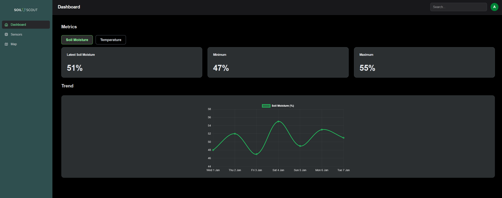

## SoilScout — Site Health Monitoring Dashboard

A clean, responsive **Next.js sensor dashboard** designed for clarity, scalability, and modern UI best-practice.
Visualizes soil moisture + temperature trends, includes responsive chart display, and supports future expansion to real API data streams.

---

<br>

## 📸 UI Preview



---

<br>

## 🚀 Features

| Feature                      | Detail                                                     |
| ---------------------------- | ---------------------------------------------------------- |
| 📊 Sensor Metric Dashboard   | Soil Moisture + Temperature with trend visualisation       |
| 🔄 Metric Toggle             | Instantly switch data displayed in the chart               |
| 📈 Summary Stats             | Min / Max / Latest values auto-computed via custom hook    |
| 🎨 Responsive UI + Dark Mode | Works on desktop + mobile, theme persists via localStorage |
| 🧠 Clean Component System    | Card, Toggle, Dashboard Sections, Sidebar, Topbar          |
| 🧪 Cypress E2E Test Included | Verifies metric switching behaviour end-to-end             |

---

<br>

## 🗂 Project Structure

```
app/
 ├─ layout.js                        → Global Root Layout (Sidebar + Topbar)
 ├─ page.js                          → Dashboard Home
 ├─ components/dashboard/
 │   ├─ MetricCard.js                → KPI card component
 │   ├─ MetricToggle.js              → Moisture ↔ Temperature switch
 │   ├─ MetricDisplaySection.js      → Summary + Line Chart section
 │   ├─ Sidebar.js                   → Navigation sidebar
 │   └─ Topbar.js                    → Header + Search + Avatar dropdown
 ├─ hooks/
 │   └─ useSensorData.js             → Extract + process mock data
 ├─ lib/data/mockSensorData.js       → Local 7–14 point sensor dataset
 ├─ globals.css                      → Theme + visual system variables
cypress/e2e/       → Verifies chart metric toggle
public/                              → Logos + static assets
```

---

## ⚙ Requirements

| Dependency  | Version           |
| ----------- | ----------------- |
| **Node.js** | `18+` recommended |
| **npm**     | bundled with Node |

Check version:

```bash
node -v
npm -v
```

---

<br>

## Setup & Run Locally

Clone repo and install dependencies.

```bash
git clone <repo-url>
cd soilscout-dashboard
npm install
npm install lucide-react
npm run dev
```

Now visit:

🔗 **[http://localhost:3000](http://localhost:3000)**

---

<br>

## Run Cypress Tests

Open a new command prompt terminal.

cd into project.

```bash
npm install cypress
npx cypress run
```


---
